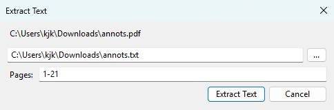

# Extract text from PDF using SumatraPDF

**Available in [pre-release 3.7](https://www.sumatrapdfreader.org/prerelease)**

## In application

To extract pages from a PDF in SumatraPDF:
- open PDF document
- `Ctrl + k` for [command palette](Command-Palette.md)
- `Extract Text From Document`

Or:
- open PDF document
- right-click for context menu
- `Document` > `Extract Text From Document`



This extract text from the document and saves it as a text file. 

You can also extract from all pages or select a subset of pages.

## From command-line

You can use SumatraPDF cmd-line to extract text from a PDF file.

### Extract all text from PDF

`SumatraPDF convert -o output.txt input.pdf`

### Extract text from selected pages of a PDF

`SumatraPDF convert -o output.txt input.pdf 1-3,4,8-9`

This will extract text from pages 1,2,3,4,8,9.

# Structured text

PDF files don't really contain text. It's made of glyphs (characters) in a given font positioned at (x,y) position in a page.

Extracting text is based on heuristics i.e. the program tries to guess words and lines based on position of characters.

Structured text is detailed information about every character on the page:

- font
- glyph
- (x,y) position on page
- bounding box (area) of the glyph

For example, in XML format it looks like:

```xml
<font name="CharisSIL" size="7.9701">
<char quad="187.4652 295.9985 191.96033 295.9985 187.4652 301.9683 191.96033 301.9683" x="187.4652" y="301.871" bidi="0" color="#000000" alpha="#ff" flags="16" c="d"/>
```

Here it shows that letter `d` in font `CharisSIL` is at a given x/y position in the page.

You can use this output in your custom processing program.

### Extract structured text from PDF in XML format

`SumatraPDF draw -o foo.stext foo.pdf`

### Extract structured text from PDF in JSON format

`SumatraPDF draw -o foo.stext.json -F stext.json foo.pdf`

It's the same information but in JSON format.
